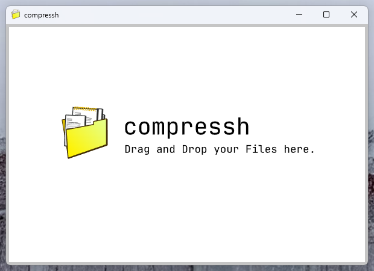

<p align="center">
  
</p>

# Compressh

A lightweight desktop application for compressing images, video, audio, and PDF files through a simple drag-and-drop interface.

Compressh was built with **Rust and Tauri** as a small experiment in creating a native desktop utility that removes the need to upload files to third-party compression websites.

## Why I Built It

While working with design and marketing assets, I often saw people use heavily advertised online compression services just to reduce the size of a PDF, image, or video.

That seemed unnecessary for something that can be handled locally.

I built the first version of Compressh over a few hours while learning **Rust and Tauri**, with two main goals:

- Keep the workflow extremely simple.
- Process files locally instead of requiring them to be uploaded to an external service.

## Application

<p align="center">
  
</p>

Using the application is intentionally simple:

1. Open Compressh.
2. Drag one or more supported files into the window.
3. Compressh detects the file type and starts the appropriate compression process.
4. The compressed file is written next to the original with `_compressed` appended to its filename.

For example:

```text
report.pdf
    ↓
report_compressed.pdf
```

Multiple files can be dropped into the application at once and are processed independently.

## How It Works

Compressh uses a small Tauri frontend for file interaction and a Rust backend for launching the appropriate compression tools.

```text
                 Compressh
                    │
            Drag-and-drop files
                    │
                    ▼
           JavaScript frontend
                    │
              Tauri command
                    │
                    ▼
              Rust backend
               /         \
              /           \
             ▼             ▼
         FFmpeg        Ghostscript
             │             │
     Image / Audio /      PDF
          Video
              \           /
               \         /
                    ▼
             Compressed file
```

The frontend listens for Tauri drag-and-drop events, validates the file extension, and invokes the corresponding Rust command.

The Rust backend performs the actual processing using:

- **FFmpeg** for images, audio, and video.
- **Ghostscript** for PDF compression.

Compression runs on separate threads so the application can process multiple dropped files without blocking the main UI.

## Supported Formats

| Type | Formats |
| --- | --- |
| Images | `.png`, `.jpg`, `.webp` |
| Video | `.mp4`, `.mov`, `.mkv`, `.avi` |
| Audio | `.mp3`, `.aac`, `.wav`, `.flac` |
| Documents | `.pdf` |

Different FFmpeg options are selected depending on the media type. PDFs are handled separately using Ghostscript's PDF writer and image downsampling options.

## Tech Stack

**Desktop application:** Tauri 2  
**Backend:** Rust  
**Frontend:** HTML, CSS, JavaScript  
**Media processing:** FFmpeg  
**PDF processing:** Ghostscript

## Project Structure

```text
compressh/
├── assets/
│   ├── front.svg
│   └── UI.png
│
├── src/
│   ├── main.js
│   └── ...
│
├── src-tauri/
│   ├── src/
│   │   ├── main.rs
│   │   └── lib.rs
│   │
│   ├── bin/
│   ├── Cargo.toml
│   └── tauri.conf.json
│
├── package.json
└── README.md
```

Most of the application logic is split between the drag-and-drop handling in the frontend and the Rust commands responsible for starting FFmpeg or Ghostscript.

## Running From Source

The project requires a working Rust and Node.js environment with the dependencies required by Tauri.

Install the JavaScript dependencies:

```bash
npm install
```

Run the application in development mode:

```bash
npm run tauri dev
```

Build a release version:

```bash
npm run tauri build
```

## Current Status

The current compression backend is primarily configured for **Windows** and bundles Windows builds of FFmpeg and Ghostscript as Tauri resources.

The Tauri application itself is designed to be cross-platform, but Linux and macOS support would require resolving and packaging the appropriate platform-specific FFmpeg and Ghostscript binaries.
